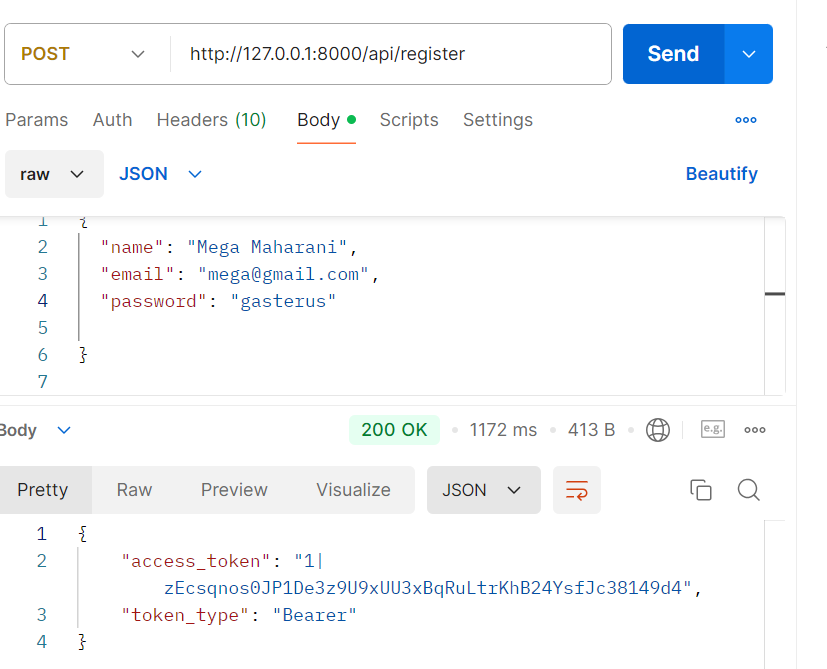
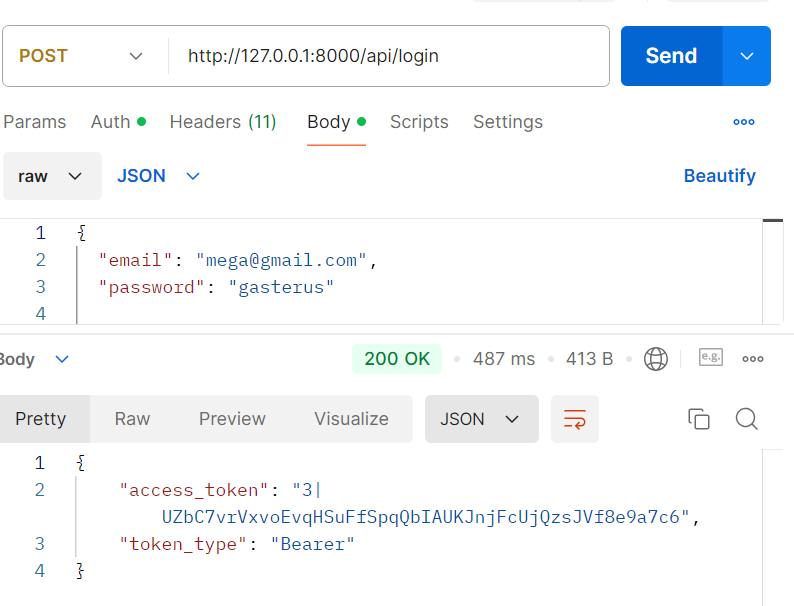
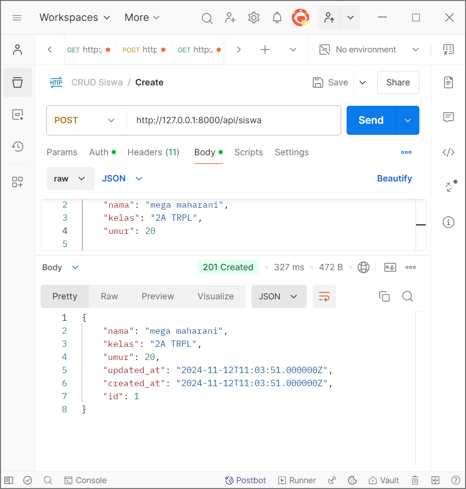
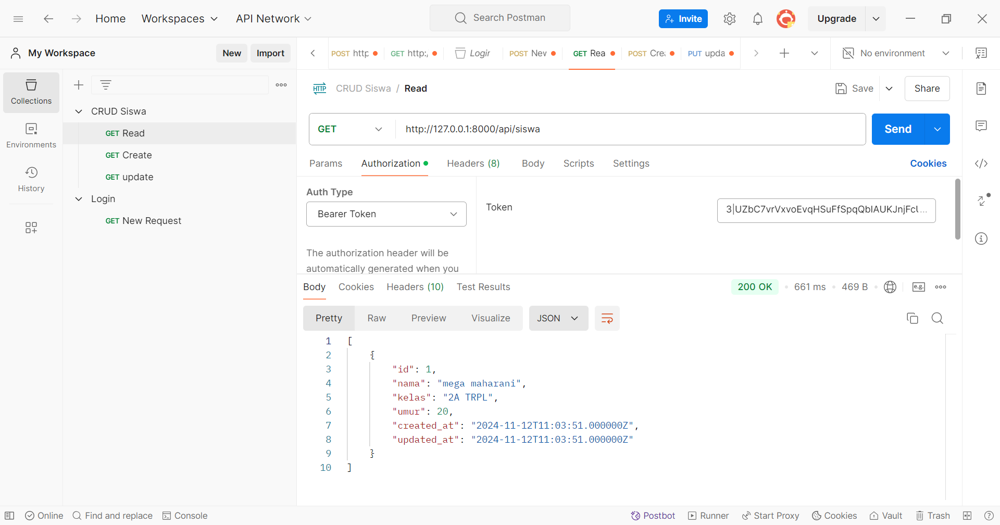
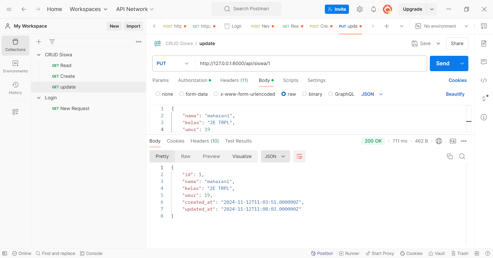
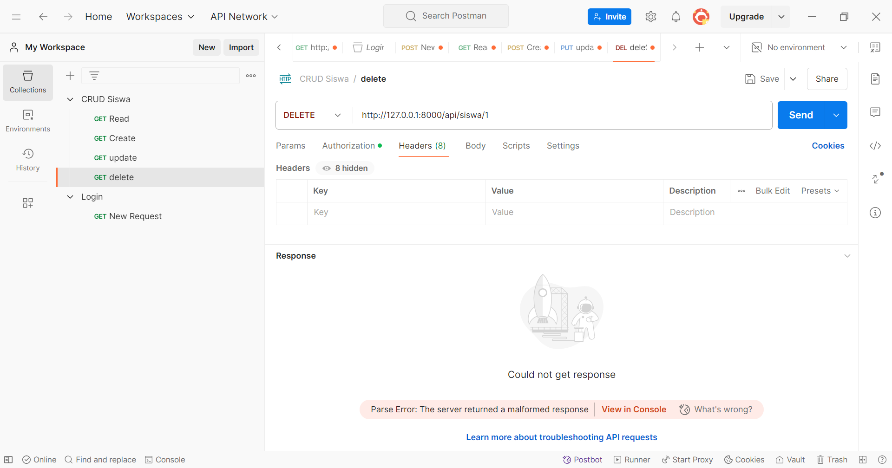
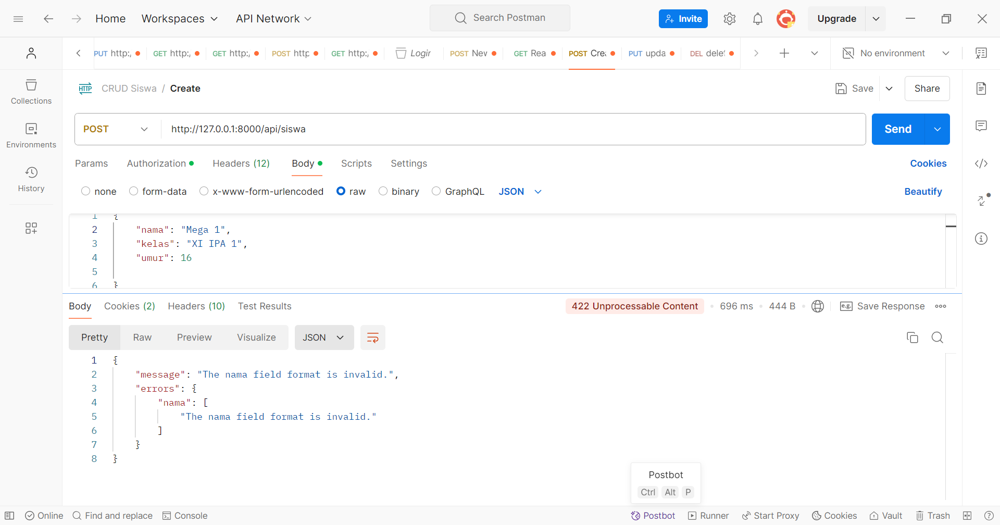
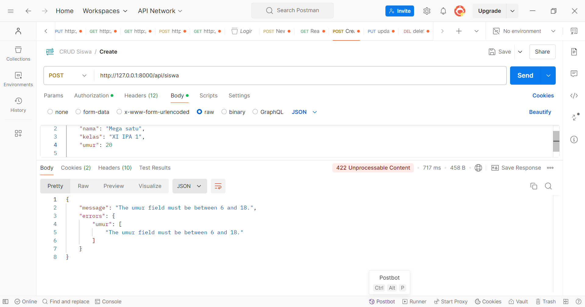

1.Install laravel 10

2.Konfigurasi Database:

3.Instalasi sanctum:

4.Publikasi konfigurasi sanctum:

5.Migrasi database:

6.Konfigurasi Sanctum

7.Konfigurasi User Model:

Autentikasi API
1.Register pengguna:

    tambahkan metode register

2.Login pengguna:
    tambahkan metode login

CRUD Data Siswa:
1.Model dan Migration:

definisikan struktur tabel:
 
    jalankan migrasi:
 
    buatlah controller untuk siswa
 
    implementasi metode CRUD di SiswaController
 
    definisi route:
 

 Debugging dan Logging:
 

 Install laravel debugbar:
 
 
 
 Pengujian API:
 
 
 
 
 
 

 Tugas Tambahan: 
 
 
 

