1.Install laravel 10
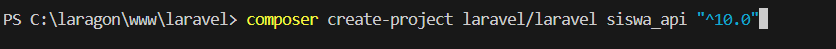

2.Konfigurasi Database:
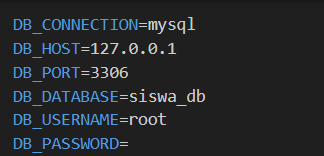

3.Instalasi sanctum:
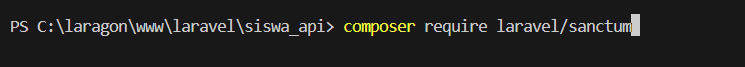

4.Publikasi konfigurasi sanctum:
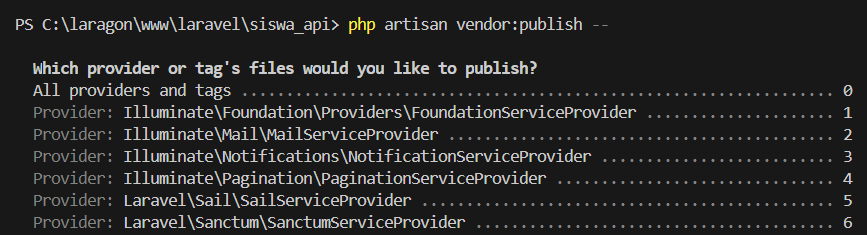

5.Migrasi database:
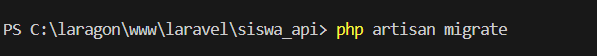

6.Konfigurasi Sanctum
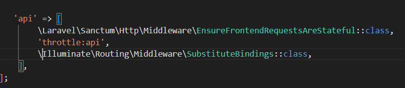

7.Konfigurasi User Model:
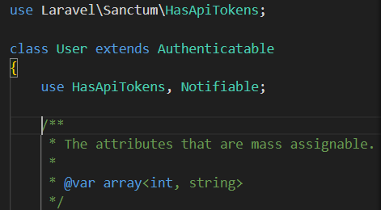

Autentikasi API
1.Register pengguna:
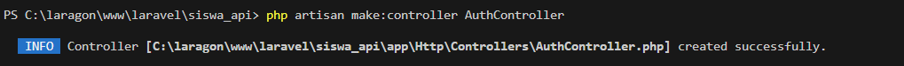

    tambahkan metode register
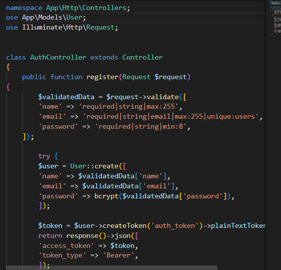

2.Login pengguna:
    tambahkan metode login
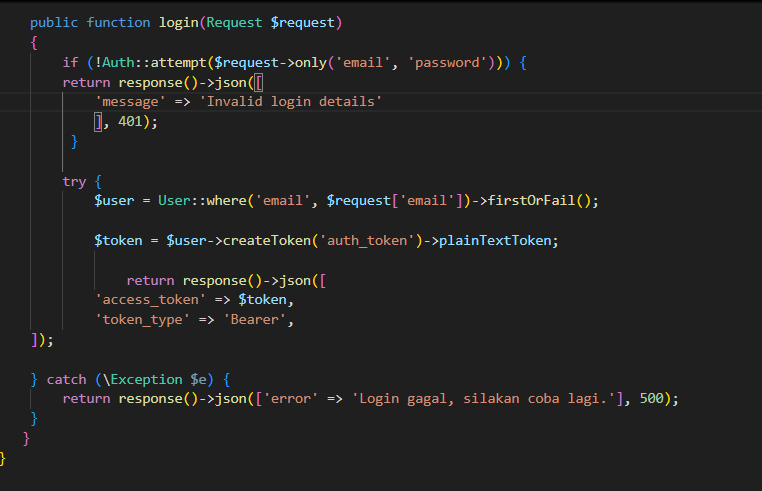

CRUD Data Siswa:
1.Model dan Migration:
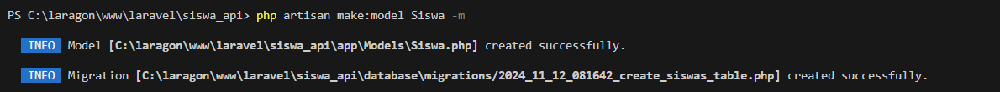
definisikan struktur tabel:
 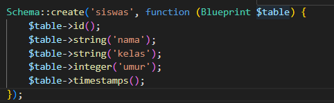
    jalankan migrasi:
 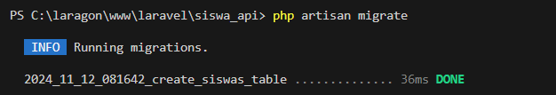
    buatlah controller untuk siswa
 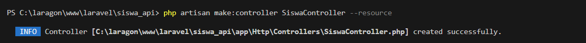
    implementasi metode CRUD di SiswaController
 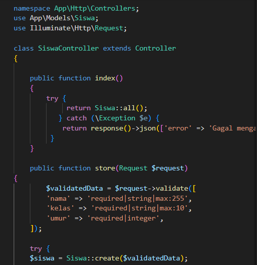
    definisi route:
 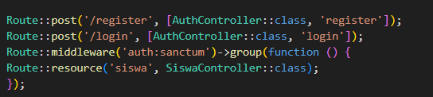

 Debugging dan Logging:
 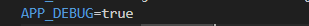

 Install laravel debugbar:
 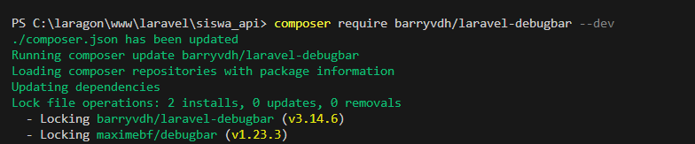
 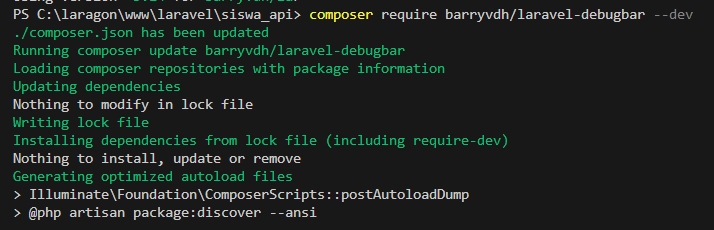
 